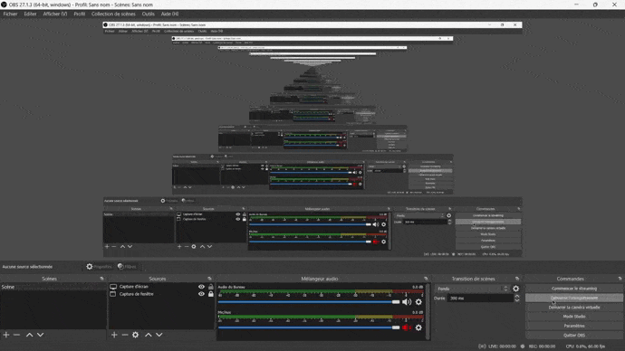

# Markdown
***this is a test of different MarkDown elements presented in the book
[markdown-guide](https://dl.icdst.org/pdfs/files3/c79990b0b853932d36ddc117ce2503e3.pdf)***

# 1. Headings 


# h1
## h2
...
###### h6


---
You can use HTML attributes like this : 
(see source code of this file to see the tag)
<br>

# 2. text formatting
this is paragraph lorem ipsum ...  
for **line break** use `space space enter`  

**this is bold text**  
*this is italic*  
_this is italic_  
***this is bold and italic too***  

__*You can also combine star and underscore (see code)*__

>this is block quote

>this 
>
>is mutliple blcok quote, on multiple lines
>
> just make sure to add the '>' in all the lines. 

>this is 
>>nested block quote  
>>okay  
>
>thanks  
  
> ## this is a block quote 
> **combined with other elements**    
  

**to add a link with a title (title is optional)**  
Use [Duck Duck Go](https://duckduckgo.com "My search engine!").  


**Quick links an URL**  
<https://eff.org> for urls just type `<url>`  
<omarihamza2000@gmail.com> for emails just type `<email>`  
**[link to certain webpage in bold](https://eff.org)**.

**referenced urls**
this is a [refferenced URL][1]  see code to understand
<!-- The refference here for readability purposes should be put on the bottom of the file -->
[1]: <https://en.wikipedia.org/wiki/Hobbit#Lifestyle> "Hobbit lifestyle"

to add a line (horizontal rule) just type --- or *** or ___

---
***
___

# 3. Lists 
1. **Ordered list**  
    1. this 
    2. is 
    3. ordered    
        1. and   
        this is just a paragraph between the list items
        2. nested
    4. list

2. **Unordered list**
    - this 
    - is 
    - unordered 
        - and 
        >
        > block quote in lists looks amazing
        - nested
    - list 
---
# 4. code Blocks

To create code blocks, 

        <html>
        <head>
            <title>Test</title>
        </head>

indent every line of the block by at least four spaces or one
tab.

> **Warning** this in github looks with icon warning  
> As of May 22, 2023: If you update `dearpygui` to `1.9.1`, you will not be able to connect to the node<br>Please install `1.9.0` or below *Under investigation

# 5. Images
To add an image, add an exclamation mark (!), followed by alt text in brackets, and the path or URL to the image asset in parentheses. You can optionally add a title after the URL in the parentheses.


**local image**    
we can either use absolute of relative path  
(see the gif for the relative path)


**Hosted image** <br>


## GIF + Embed an image with a link 
**syntax**

```md
[](destination_link)
```
<br>

[](https://github.com/zamaS24/simple_stereo)


# 6. Escaping characters 
\*this would've been a list without the \\ 

\\ this is backslash  
\_this is underscore  
In General use backslash to escape the chacarters

# 7. Tables 
| Syntax | Description |
| --- | --- |
| &#124; Header | Title |
| Paragraph | Text |

you can align text by using
- :--- left to right
- ---: right to left
- :---: center

__You can format text in tables as you wish.__


# 8. Fenced code blocks
~~~ json
{
    // You see for example this is JSON
    "firstname": "OMARI", 
    "lastname": "Hamza", 
    "Age":22
}
~~~

**folder structure**

__You can generate this by using__
```cmd
tree 
```

<pre>
│  app.py
│  keypoint_classification.ipynb
│  point_history_classification.ipynb
│
├─model
│  ├─keypoint_classifier
│  │  │  keypoint.csv
│  │  │  keypoint_classifier.hdf5
│  │  │  keypoint_classifier.py
│  │  │  keypoint_classifier.tflite
│  │  └─ keypoint_classifier_label.csv
│  │
│  └─point_history_classifier
│      │  point_history.csv
│      │  point_history_classifier.hdf5
│      │  point_history_classifier.py
│      │  point_history_classifier.tflite
│      └─ point_history_classifier_label.csv
│
└─utils
    └─cvfpscalc.py
</pre>

<details>
<summary> Input Node </summary>
this is not showing in the preview   

# Some title

</details>


<br>  

```python 
# and this is python
import numpy as np 

arr = np.Array()
```

# 9. Footnotes
where you added the footnote reference. Readers can click the link to jump to the
content of the footnote at the bottom of the page
Add the footnote using another caret and number inside brackets with a colon
and text ([^1]: My footnote.). You don’t have to put footnotes at the end of the
document. You can put them anywhere except inside other elements like lists, block
quotes, and tables.

Here's a simple footnote,[^1] and here's a longer one.[^bignote]


# 10. Headings id [#custom-id]


# Extra stuff for the previous elements
[^1]: This is the first footnote.
[^bignote]: Here's one with multiple paragraphs and code.

Indent paragraphs to include them in the footnote.

`{ my code }`

Add as many paragraphs as you like.