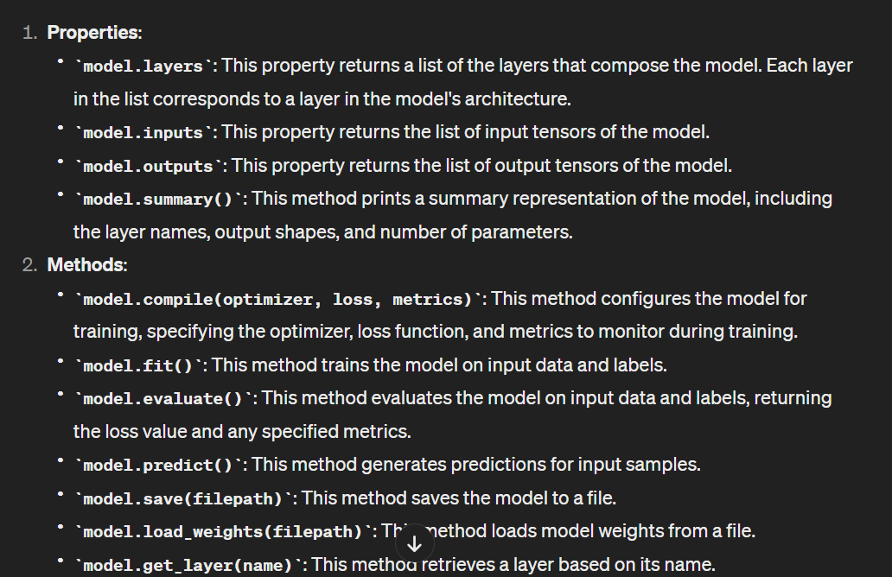

    ### Notes for colab stuff 


##  Contents 
contents are stored in `/content`

## Running sequential shell commands 
in collab we can't like run commands sequentially for example 
```
! cd /
! ls
```
this will not take us to the root directory 
instead we should use the `&&` operator 
```
! cd / && ls 
``` 

or use the `os` library 
```py
import os 
os.chdir('/')
```


## difference between `!` and `%`
**1.  % Commands (Magic Commands)**   

    Magic commands in Colab are used to perform various actions and configurations within the notebook environment.
    They are prefixed with % followed by the command name.
    Magic commands are specific to IPython, the interactive Python shell used by Jupyter notebooks.
    Examples of % commands in Colab include %matplotlib inline for inline plotting, %timeit for timing code execution, %cd for changing the current directory, and %tensorflow_version for specifying the TensorFlow version to use.


 **2. ! Commands (Shell Commands)**

    Shell commands in Colab are used to execute commands directly in the underlying Linux shell environment.
    They are prefixed with ! followed by the shell command.
    Shell commands allow you to interact with the file system, install packages using pip or apt, run scripts, and execute any other command available in the shell.
    Examples of ! commands in Colab include !ls for listing files in the current directory, !pip install package_name for installing Python packages, !git clone repository_url for cloning a Git repository, and !wget file_url for downloading files from the web.


<br>  

# COURSE 1 

###  Creating a model (Neural network)
```py 
   model = tf.keras.Sequential([
        tf.keras.layers.Dense(units=1, input_shape=[1]),

        tf.keras.layers.Dense(units=1, input_shape=[1])
    ])
    # In a Sequential model, only the first layer needs to have the input_shape parameter specified. parameter defines the shape of the input data that will be fed into the model. Subsequent layers automatically infer the input shape from the output shape of the previous layer, so there is no need to explicitly specify it for each layer.
    # layers.Dense to create a fully connected
    # untis : number of neurones 
    # input_shape= shae of input
```


### Compiling the model 

```py 
 model.compile(optimizer='sgd', loss='mean_squared_error')
```

### Training the model 
```py 
 model.fit(xs, ys, epochs=1000)
```

### Making predictions
```py 
new_x = 7.0
prediction = model.predict([new_x])[0]


# returns list of predictions
# For example, if you provide model.predict([[7.0], [8.0], [9.0]]), the method will return a list of predictions for each of the input values [7.0], [8.0], and [9.0].
```


```py 
inputs = tf.convert_to_tensor(inputs)
```

in numpy element wise operations not only on array but even on tensors for example 3d tensoer, the element wiser will be spreaded to all elements of the tensor. 


 `Sparse categorical crossentropy` is a loss function commonly used in classification tasks 
where the labels are integers instead of one-hot encoded vectors. It is suitable when the target values are integers 
and there are more than two classes in the classification problem.


In TensorFlow, `tf.nn` is a module that provides low-level neural network operations.


some tensors in tensorflow 
```py
# Declare sample inputs and convert to a tensor
inputs = np.array([[1.0, 3.0, 4.0, 2.0]])
inputs = tf.convert_to_tensor(inputs)
print(f'input to softmax function: {inputs.numpy()}')
```

There isn't a significant impact -- because this is relatively simple data. For far more complex data (including color images to be classified as flowers that you'll see in the next lesson), extra layers are often necessary.

This is a side effect of something called 'overfitting' which you can learn about later and it's something you need to keep an eye out for when training neural networks. There's no point in wasting your time training if you aren't improving your loss, right! :) 

<br>

**some additional model stuff** 


--- 
### **CALLBACKS** 


```py


class myCallback(tf.keras.callbacks.Callback):
  def on_epoch_end(self, epoch, logs={}):
    '''
    Halts the training when the loss falls below 0.4

    Args:
      epoch (integer) - index of epoch (required but unused in the function definition below)
      logs (dict) - metric results from the training epoch
    '''

    # Check the loss
    if(logs.get('loss') < 0.4):

      # Stop if threshold is met
      print("\nLoss is lower than 0.4 so cancelling training!")
      self.model.stop_training = True

# Instantiate class
callbacks = myCallback()
```

***then you call it like this:***

```py
# Train the model with a callback
model.fit(x_train, y_train, epochs=10, callbacks=[callbacks])

```

***LIST OF CALLBACKS***  

`on_epoch_begin`: Called at the beginning of every epoch.

`on_epoch_end`: Called at the end of every epoch.

`on_batch_begin`: Called at the beginning of every batch.

`on_batch_end`: Called at the end of every batch.

`on_train_begin`: Called at the beginning of training.

`on_train_end`: Called at the end of training.

`on_test_begin`: Called at the beginning of evaluation (during model evaluation using model.evaluate()).

`on_test_end`: Called at the end of evaluation.

`on_predict_begin`: Called at the beginning of prediction (during model prediction using model.predict()).

`on_predict_end`: Called at the end of prediction.


### chatgpt : Example of setting recall metric in training (not tested it)

In the context of TensorFlow/Keras, when you define custom metric functions or custom callback functions, they typically accept two parameters: y_true and y_pred.

```py
from tensorflow.keras.models import Sequential
from tensorflow.keras.layers import Dense
from tensorflow.keras.metrics import Recall
import tensorflow as tf

# Define a custom recall metric function
def recall(y_true, y_pred):
    true_positives = tf.keras.backend.sum(tf.keras.backend.round(tf.keras.backend.clip(y_true * y_pred, 0, 1)))
    possible_positives = tf.keras.backend.sum(tf.keras.backend.round(tf.keras.backend.clip(y_true, 0, 1)))
    recall = true_positives / (possible_positives + tf.keras.backend.epsilon())
    return recall

# Create a Sequential model
model = Sequential([
    Dense(64, activation='relu', input_shape=(10,)),
    Dense(1)
])

# Compile the model with accuracy, loss, and recall metrics
model.compile(optimizer=tf.optimizers.Adam(),
              loss='sparse_categorical_crossentropy',
              metrics=['accuracy', recall])

# Print the model summary
model.summary()
```


#### ***metrics list***
 - :link: https://gist.github.com/arnaldog12/5f2728f229a8bd3b4673b72786913252

During each iteration within an epoch, the y_true parameter remains constant because it represents the ground truth labels for your dataset, which are fixed.

On the other hand, the y_pred parameter varies during each iteration within an epoch. It represents the predicted labels or values `generated by your model` based on the input data for that particular iteration.

In a classification problem like the MNIST dataset with 10 classes, y_pred will indeed be an array or tensor containing the predicted probabilities or scores for each class for each sample in your batch. In other words, it will contain the model's predictions for that batch of data.

For example, if you have a batch of 32 images, each with 10 classes, y_pred will be a 2D array of shape (32, 10), where each row represents the predicted probabilities for each class for one image in the batch.

During training, the model makes predictions on each batch of data, and these predictions are compared with the ground truth labels (y_true) to compute metrics such as accuracy, precision, recall, etc., for that batch. This process repeats for each batch within each epoch until the entire dataset has been processed.


--- Another discussion 
I apologize for any confusion caused by the conflicting information provided. Let me clarify:

y_pred is typically an array of probabilities rather than a binary array. It represents the predicted probabilities for each class outputted by the model. Each element of y_pred corresponds to the model's confidence or probability that the input belongs to a particular class.

In a binary classification scenario, y_pred will have a shape of (batch_size, 1), where each value is the probability that the corresponding sample belongs to the positive class.

In a multiclass classification scenario, y_pred will have a shape of (batch_size, num_classes), where each row contains the predicted probabilities for each class for a particular sample.

I apologize for any confusion caused by the incorrect statement earlier. Thank you for bringing it to my attention, and I appreciate your understanding. If you have any further questions or need clarification, please feel free to ask.


<br>  

--- 
### BATCH 
In machine learning and deep learning, a batch refers to a subset of the training data that is processed together during one iteration of training. Instead of feeding the entire dataset into the model at once, training is typically performed in smaller batches.

Here's a breakdown of what a batch is:

Subset of Data: A batch is a subset of the training dataset. For example, if you have 1000 training samples and you choose a batch size of 32, each batch will contain 32 samples.

Efficient Computation: Processing data in batches is more computationally efficient than processing the entire dataset at once. It allows the model to update its parameters more frequently while training.

Stochastic Gradient Descent (SGD): Batch processing is commonly used in optimization algorithms like stochastic gradient descent (SGD). In SGD, the model parameters are updated based on the gradients computed from the loss on each batch.

Control over Memory Usage: Batching also allows for better control over memory usage, especially when working with large datasets that may not fit entirely into memory.

During training, the model iterates through the entire dataset, processing one batch at a time, until it has processed all batches in the dataset, which constitutes one epoch of training. Then, the process typically repeats for multiple epochs until the model converges to an optimal solution.

The choice of batch size can impact the training dynamics, convergence speed, and generalization performance of the model and is often a hyperparameter that needs to be tuned based on the specific problem and dataset.


### CNN 
the [`tf.keras.layers.Conv2D `](https://www.tensorflow.org/api_docs/python/tf/keras/layers/Conv2D)

and the [`tf.keras.layers.MaxPooling2D` ](https://www.tensorflow.org/api_docs/python/tf/keras/layers/MaxPooling2D)


```model.summary()```

remember that model.evaluation is on the test data . 

in THE parameters of a CNN.There is also biases 


### About overfitting

Try running the training for more epochs -- say about 20, and explore the results. But while the results might seem really good, the validation results may actually go down, due to something called _overfitting_. In a nutshell, overfitting occurs when the network learns the data from the training set really well, but it's too specialised to only that data, and as a result is less effective at interpreting other unseen data. For example, if all your life you only saw red shoes, then when you see a red shoe you would be very good at identifying it. But blue suede shoes might confuse you... and you know you should never mess with my blue suede shoes.


# Week 4 CNN

## the zip file libary 
```python 
!wget https://storage.googleapis.com/tensorflow-1-public/course2/week3/horse-or-human.zip

import zypfile
local_zip = './horse-or-human.zip'
zip_ref = zipfile.ZipFile(local_zip, 'r')
zip_ref.extractall('./horse-or-human')
zip_ref.close()

```

## image data generators 
when you use the ImageDataGenerator with the flow_from_directory method in TensorFlow/Keras, it expects your directory structure to be set up in a specific way.

Here's how the directory structure should be organized:

Your main directory (in this case, './horse-or-human/') should contain subdirectories representing each class or category of images.
Each subdirectory should contain the images belonging to that class.
For example:

```
horse-or-human/
    ├── horses/
    │   ├── horse1.jpg
    │   ├── horse2.jpg
    │   └── ...
    ├── humans/
    │   ├── human1.jpg
    │   ├── human2.jpg
    │   └── ...
    └── ...
```

In this structure, the 'horses' directory contains images of horses, and the 'humans' directory contains images of humans. You can have as many classes as needed, each represented by its own subdirectory.

When you use ImageDataGenerator with flow_from_directory, it automatically detects the subdirectories and generates batches of data with the appropriate labels based on the directory structure. It also performs image augmentation and preprocessing as specified by the generator settings.

So, to answer your question, yes, you need to have your directory set up with its child directories representing the classes or categories of images when using ImageDataGenerator with flow_from_directory. This allows the generator to properly organize and process the data for training or validation.

<br>  


**remmber**  categorical_cross_entropy for multiclass loss function 
in binary we use : binary_cross_entropy 

```py 
from tensorflow.keras.preprocessing.image import ImageDataGenerator

# Define an ImageDataGenerator with augmentation and normalization options
datagen = ImageDataGenerator(
    rotation_range=20,
    width_shift_range=0.2,
    height_shift_range=0.2,
    shear_range=0.2,
    zoom_range=0.2,
    horizontal_flip=True,
    rescale=1./255
)

# Generate batches of augmented data from a directory
train_generator = datagen.flow_from_directory( #  flow_from_directory() automatically
# determines the class labels based on the subdirectory structure of the specified directory
    'train_directory',
    target_size=(150, 150),
    batch_size=32,
    class_mode='binary'
)

model.compile(loss='binary_crossentropy',
              optimizer=RMSprop(learning_rate=0.001),
              metrics=['accuracy'])

# Example usage within model training
model.fit_generator(
    train_generator,
    steps_per_epoch=2000 // 32,
    epochs=50
)
```
- the labels are automatically assigned based on the subdirectory names. TensorFlow uses the alphabetical order of the subdirectories to assign labels to the classes. example if we have classed /cat /dog (subdirectories) then we would have : 
    - Class 0: "cat"  
    - Class 1: "dog"

- in the human horses classification: 
(human - horses ): that's why we use `binary cross entroy `  

$$L(y, \hat{y}) = -\frac{1}{N} \sum_{i=1}^{N} (y_i \log(\hat{y}_i) + (1 - y_i) \log(1 - \hat{y}_i))$$


:link: [Binary cross entropy](https://gombru.github.io/2018/05/23/cross_entropy_loss/)

:link: [optimizer](https://www.cs.toronto.edu/~tijmen/csc321/slides/lecture_slides_lec6.pdf)  Geoffrey hinton lecture 

:link: [RMSprop](https://www.tensorflow.org/api_docs/python/tf/keras/optimizers/experimental/RMSprop)


 
transformers : attention is all you need
"ستنجو إن هزم عقلك قلبك."
_ دوستويفيسكي

 
https://www.youtube.com/watch?v=bCz4OMemCcA
    


#### graphviz installation [:link: Link ](https://forum.graphviz.org/t/new-simplified-installation-procedure-on-windows/224)


### hisotry = model.fit(...)


### using the keras.model 

```py 
class MyModel(keras.Model):
    def __init__(self):
        super().__init__()
        self.dense1 = keras.layers.Dense(32, activation="relu")
        self.dense2 = keras.layers.Dense(5, activation="softmax")
        self.dropout = keras.layers.Dropout(0.5)

    def call(self, inputs, training=False):
        x = self.dense1(inputs)
        x = self.dropout(x, training=training)
        return self.dense2(x)

model = MyModel()

```


