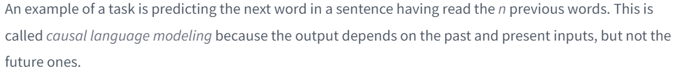
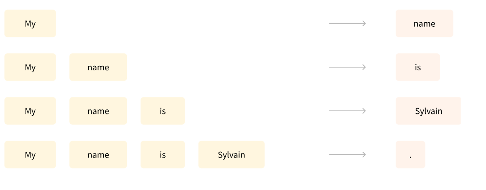
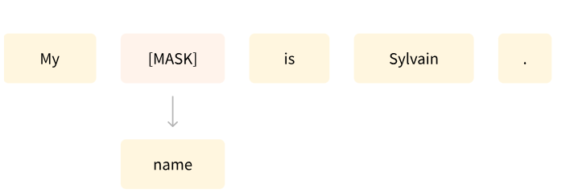
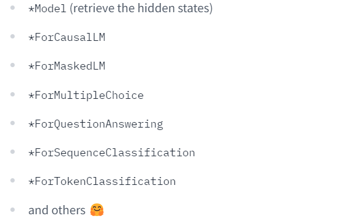
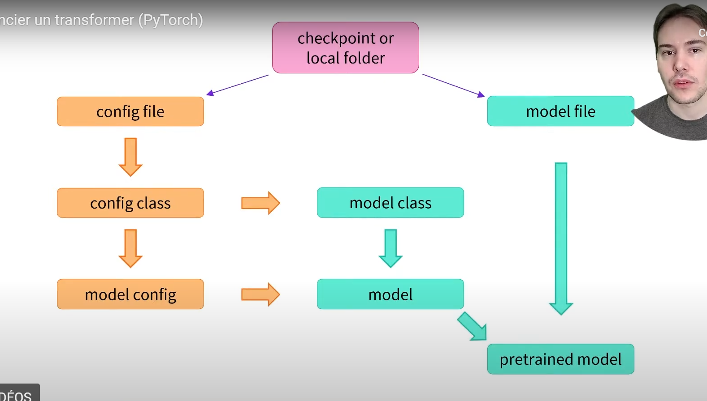
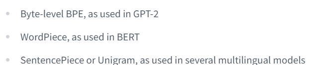
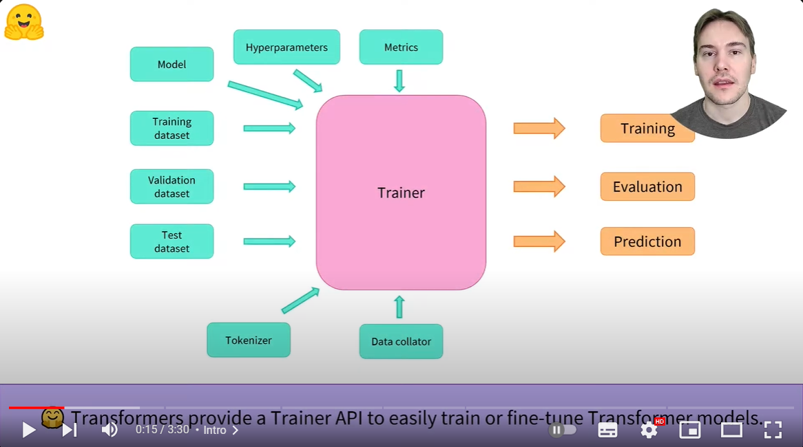
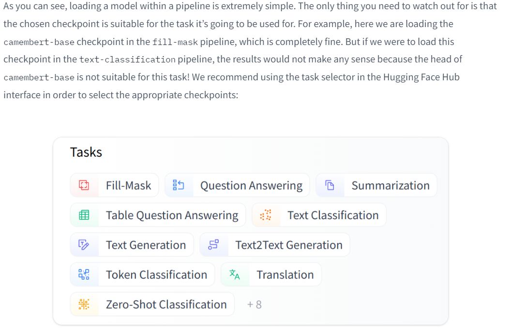

# 1 : les transformers 

GPT like architecture called : autoregressive transformers model 
BERT-like (also called auto-encoding Transformer models)
BART/T5-like (also called sequence-to-sequence Transformer models)

Transformers are language models:
    This means they have been trained on large amounts of raw text in a self-supervised fashion






The carbon footprint of transformers : since they take lot of ressources 

Transfert learning : initialize a model parameters, with a previously trained model parameters


Fine-tuning a model therefore has lower time, data, financial, and environmental costs. It is also quicker and easier to iterate over different fine-tuning schemes, as the training is less constraining than a full pretraining.


Auto-regressive : the outputs of the encoder passed to the mid level input of the decoder ? (must confirm)


### Encoder models   
most populare BERT  
alBERT   
distilBERT   
ELECTRA  
RoBERta   

masked language model : predicting a word in a sequence of words : my <mask> is sylvian   
<mask> will be predicted as name   
notice we would need also future words and previous words to predict the mask   

### Decoder models   

 having only access to the left context 


In BERT, the model's architecture focuses on bidirectional context understanding by masking some of the input tokens and predicting them based on the surrounding tokens. This approach is particularly effective for tasks like text classification, question answering, and named entity recognition, where understanding the context of the entire input sequence is crucial.


On the other hand, models like GPT use a unidirectional decoding strategy. They generate text token by token, predicting the next token based on the previously generated ones. This makes GPT suitable for tasks like text generation, language modeling, and completing prompts.


### causal language modeling 

autoragressive model, use the previous outputs as inputs in teh following steps

### sequence to sequence models 
T5 uses encoder decoder architecture 
BART 
mBART
Marian
T5


<br>

# 2  utilisation de transformers 

raw_text -> tokens -> special tokens 
            des mots -> plus [CLS] [SEP] ..etc


### behind the pipeline 


the model without specification retuns the contextualized representation of the inputs 768 in out case

if we want to do a task we need to specify : 



to get the labels: 
```
model.config.id2label
```


### Models 
configuration of the model 

build the model from the config : 
```py 
from transformers import BertConfig, BertModel

# Building the config
config = BertConfig()

# Building the model from the config
model = BertModel(config)
```



we can change the parameters of the configuration of the model 
for example: saying I need only 10 hidden layers instead of 12


saving method 
```
model.save_pretrained("directory_on_my_computer")
```

this saves two files on the computer : 
```
ls directory_on_my_computer

config.json pytorch_model.bin
```


you can also use the raw tensors as inputs to the model 

### tokenizers 
there is three types of them : 

* word based 
* character based 
* subword based, exemple (toke nizers)

some techniques : 



### Handling multiple sequences 
- models expect a batch of inputs 
- the model expects inputs in batch size, so be careful if you pass only one input 

`.tokenize()` to get the actual tokens 

padding the input with the `tokenizer.pad_token_id`
also the padding can be done for : 
    - 'max length' 512 for BERT OR distilBERT
    - longest
    - or we specify 

we have truncation 
return tensors 'pt' or 'np' or 'tf' 

we have some special tokens too [CLS] [SEP] ... etc 
### putitng it all together 
tokenizer(sequence) returns everything that is necessary for us (for the model to operate)

padding and truncating in the tokenizer 
the return_tensor='pt' parameter in the tokenizer 

<br>


# 3 Fine tuning pre-trained model 
### processin the data 

resume

* you have the datasetDict 
* raw_dataset['train'] is a dataset class 
* a dataset has num_rows and featrures 

* you can slice a dataset object `dataset[:sliced]` (will return a small dataset of type dictionary )

* you can access the whole features at once `dataset['feature']`
* you can access the sample `dataset[0]`

* then you have features and num rows hyperparameters 
* the you haev the train and validation and **both are indexable**


* for tokenizing it you gotta use the map function 
* use the collator for dynamic padding

raw dataset looks like this 
```py
DatasetDict({
    train: Dataset({
        features: ['sentence1', 'sentence2', 'label', 'idx'],
        num_rows: 3668
    })
    validation: Dataset({
        features: ['sentence1', 'sentence2', 'label', 'idx'],
        num_rows: 408
    })
    test: Dataset({
        features: ['sentence1', 'sentence2', 'label', 'idx'],
        num_rows: 1725
    })
})
```

so basically a dictionary, we have 
dataset['train']
dataset['test']

and then the 
dataset['train'][0] : also retunrs an object with the features like this 
dataset['train'][0]['sentence1'] : to get the feature 

dataset class: 
    features  
    numrows   
    [indexable]  


Now we need to tokenize the dataset :   
:warning:  this is bad 
```py 
tokenized_dataset = tokenizer(
    raw_datasets["train"]["sentence1"],
    raw_datasets["train"]["sentence2"],
    padding=True,
    truncation=True,
)
``` 
that's very expensive , we neeed to map the dataset and use the function 

```py
def tokenize_function(example):
    return tokenizer(example["sentence1"], example["sentence2"], truncation=True)

tokenized_datasets = raw_datasets.map(tokenize_function, batched=True)
tokenized_datasets
```
this code will add the input ids and attention mask features to the original dataset 


DataCollator (dynamic padding)


```py
from transformers import DataCollatorWithPadding

data_collator = DataCollatorWithPadding(tokenizer=tokenizer)
```

batch = data_collator(samples)

this will guarantee that the batch is rectangular


### Fine tuning a model withthe trainer api or keras 




we gotta use the TrainingArguments that will contain all the hyperparameters 
```py 
from transformers import TrainingArguments

training_args = TrainingArguments("test-trainer")
```


the tokenized dataset 
```py 
tokenized_datasets = raw_datasets.map(tokenize_function, batched=True)
```

the TrainingArguments(folder_path) : directory where the train model will be saved 

You will notice that unlike in Chapter 2, you get a warning after instantiating this pretrained model. This is because BERT has not been pretrained on classifying pairs of sentences, so the head of the pretrained model has been discarded and a new head suitable for sequence classification has been added instead. The warnings indicate that some weights were not used (the ones corresponding to the dropped pretraining head) and that some others were randomly initialized (the ones for the new head). It concludes by encouraging you to train the model, which is exactly what we are going to do now


we first create the trainer  
```py
trainer = Trainer(
    model,
    training_args,
    train_dataset=tokenized_datasets["train"],
    eval_dataset=tokenized_datasets["validation"],
    data_collator=data_collator, # this one is very important 
    tokenizer=tokenizer,
)
```
Data collators handle this by dynamically padding or truncating sequences to ensure that each batch has uniform dimensions. Additionally, they may perform other tasks such as tokenization and converting text inputs into numerical representations that the model can understand.


to fine tune : 
```py 
trainer.train() 
```


Evaluation 

```py 
predictions = trainer.predict(tokenized_datasets["validation"])
print(predictions.predictions.shape, predictions.label_ids.shape)
```

```py
import numpy as np

preds = np.argmax(predictions.predictions, axis=-1)
```


```py
import evaluate

metric = evaluate.load("glue", "mrpc")
metric.compute(predictions=preds, references=predictions.label_ids)
```
will output :   
        
    {'accuracy': 0.8578431372549019, 'f1': 0.8996539792387542}


**Metrics at the end of each epoch**
```py
training_args = TrainingArguments("test-trainer", evaluation_strategy="epoch")
model = AutoModelForSequenceClassification.from_pretrained(checkpoint, num_labels=2)

trainer = Trainer(
    model,
    training_args,
    train_dataset=tokenized_datasets["train"],
    eval_dataset=tokenized_datasets["validation"],
    data_collator=data_collator,
    tokenizer=tokenizer,
    compute_metrics=compute_metrics,
)


trainer.train()
```


### A full training 
we used pytorch to make a training loop 


# 4. sharing models and tokenizers 

### Using pretrained models 


be careful about the imports based on the **task**

### sharing pretrained models 

using the interface 
using push to hub api 

> :memo: **NOTE** 
> I have skipped this chapter since it is not benfical for 
> the programming thing.


# 5. The dataset library 


### what if my dataset isn't on the hub 
Example : 
from datasets import load_dataset 

CSV : load_dataset("csv", data_files="my_file.csv")
DataFrame (pandas) : load_dataset("pandas", data_files="my_dataframe.pkl")


By default, loading local files creates a DatasetDict object with a train split.


squad_it_dataset["train"][0]

